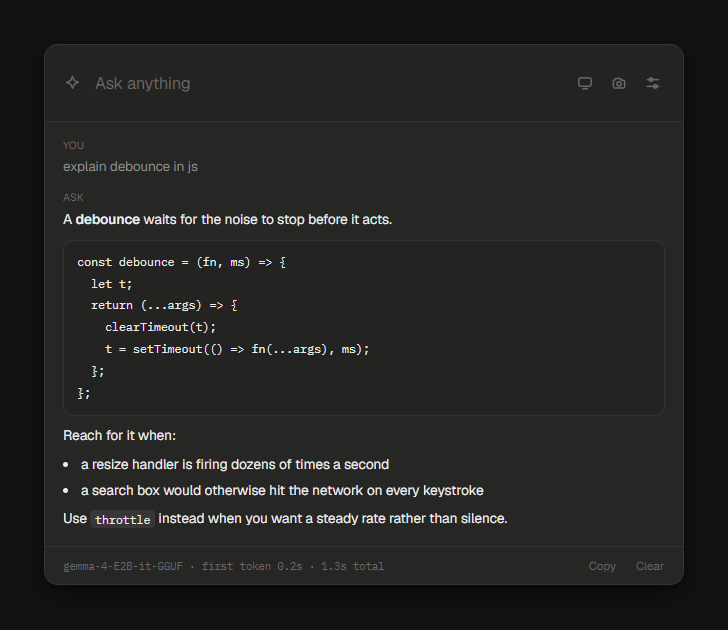

# Ask

A small window that appears on a keypress, asks a model running on your own
machine, and gets out of the way.



The model is whatever you have loaded in [Unsloth](https://unsloth.ai/docs/desktop).
Ask never runs a model itself; it talks to Unsloth's local server and paints
the answer.

Your conversation stays on the machine. Web search is the one exception, and it
is the one worth making: with it off, a small model asked about anything recent
invents a plausible answer rather than admitting it cannot know. Search sends
your search terms and nothing else. Turn it off in settings if you would rather
it did not.

## Install

1. Download **Ask-Setup.exe** from the
   [latest release](https://github.com/Chimppppy/Ask-Widget/releases/latest).
2. Run it. Ask starts in the system tray.
3. Open Unsloth, load a model, then press `Ctrl` + `Shift` + `Space`.

The installer is currently unsigned, so Windows may show a SmartScreen warning.
Choose **More info**, then **Run anyway** if you downloaded it from this repo.

### Run from source

Install [Node.js](https://nodejs.org), then:

```bash
npm install
npm start
```

To create the installer yourself:

```bash
npm run dist
```

Then run `dist/Ask Setup 0.1.0.exe`. It installs for your user and creates Start
Menu and desktop shortcuts.

## Setting up the engine

1. Open Unsloth Desktop and load a model. A small one is the point here —
   `unsloth/gemma-4-E2B-it-GGUF` answers fast enough to be worth a keybind, and
   it can read images.
2. In Unsloth, click your avatar at the bottom left, then Settings, then API.
   Create a key and copy it. It starts with `sk-unsloth-` and is only shown once.
3. In Ask, press the settings button on the right of the ask line and paste the
   key in. Press "Test connection" and the model list fills in.

The address is `http://localhost:8000` unless Unsloth took a different port. If
it did, Ask finds it on its own and remembers.

## Using it

Press the shortcut, type, press Enter. The window is one line until there is an
answer to show, then it grows to fit and stops at about two thirds of your
screen.

Press the shortcut again, press Esc, or click anywhere else and it goes away.
An active answer keeps running in the background and is there when you bring the
window back. Only the **Stop** button cancels it. The conversation stays until
you press Clear or quit Ask.

Choose System, Light, or Dark under **Settings → General → Appearance**.

### Showing it your screen

Three ways, in increasing order of how little work they are.

**A region.** Press the camera button, or `Ctrl` + `S`, and the screen freezes.
Drag a rectangle over the part you mean. Esc, or a click without a drag,
cancels.

**The whole screen.** Press the monitor button, or `Ctrl` + `Shift` + `S`. The
widget takes itself out of the picture first, so you get what was behind it.

**Every time, without asking.** Turn on "Capture when Ask opens" in settings.
The screen is grabbed at the moment you press the shortcut,
before the window is drawn, so the flow is: look at the email, press the key,
type "reply to this saying Thursday works".

**Or let it look by itself.** "Let the model look when needed" gives the
model a `see_screen` tool, so it decides when it needs to see. Ask "what does
this error mean" and it takes the picture on its own. The widget blinks out of
the way while it does, and the picture it took is shown in the answer, so a
screenshot is never taken silently.

Clear references to shared context are handled before the model has a chance to
miss the cue. "Reply to this email," "explain this error," and "summarize this
page" automatically look at the screen when no image or pasted content was
provided. A generic request such as "write a follow-up email" does not.

Web search can also include image results. Ask enables Unsloth's image-query
mode so the model can compare likely matches during visual identification or
find reference images when the request calls for them. This remains part of
the read-only web-search flow.

Reasoning is captured but hidden by default. Turn on "Show model thinking" in
settings when seeing the live reasoning is useful for debugging a model; leave
it off to keep the widget focused on tool activity and the final answer.

Between the last two: auto-attach is predictable and costs one capture per
opening; the tool is tidier but depends on the model actually reaching for it,
which a small model does not always do. Turn on whichever annoys you less.

A word on which to use. Anything larger than 1280 on its long edge is scaled
down to that before it is sent, so a tight region keeps far more detail than a
whole screen does. On a 1080p monitor the whole screen only loses a third of its
size and stays quite readable; on a 4K one it loses three quarters, and small
text with it. Reading a full desktop is the hardest version of the job you can
give a small model — when an answer looks like it misread something, crop
tighter before you blame the model.

You can attach more than one region. They go with the question you are typing
and are not carried into later ones — a screenshot from four questions ago is
worse than no screenshot, and the context is better spent on the conversation.

### Keyboard

| Key | What it does |
| --- | --- |
| `Ctrl` + `Shift` + `Space` | Show or hide the window |
| `Enter` | Ask |
| `Ctrl` + `S` | Pick a region of the screen |
| `Ctrl` + `Shift` + `S` | Attach the whole screen |
| `Esc` | Close settings or hide the window; active answers keep running |

The shortcut can be changed in settings. Click the box and press the
combination you want.

Windows gives a combination to whichever app asked for it first, and it does so
silently. If the one you pick is already taken, Ask says so instead of leaving
you pressing a dead key, and the tray tooltip tells you the same.

## Searching, and running code

Unsloth can run three things at its own end, switched on per tool in settings:

| Tool | Default | What it is for |
| --- | --- | --- |
| Web search | **on** | Current facts: releases, prices, CVEs, anything after the model's training |
| Python | off | Arithmetic it would otherwise get wrong, quick data work |
| Shell commands | off | Running things on the machine |

Search is the one that changes the answers most. A two-billion-parameter model
has no idea what happened after it was trained, and left to itself it will fill
the gap with something that reads correctly and is wholly invented. With search
on it looks first.

**Ask cannot gate these.** Unsloth runs them itself and only streams back the
result, so the confirmation you get for MCP tools does not and cannot apply
here. That is why Python and shell are off to begin with and carry a warning
next to them. If you want shell access that stops and asks, use an MCP server
for it instead.

Anything the server ran is shown in the answer as its own row, so you can see
that it searched and what it searched for.

## Tools

Ask speaks MCP, so the model can reach things that are not on your screen:
notes, calendars, inboxes, files, whatever you have a server for.

`mcp.json` takes the same shape as Claude Desktop's config, so an entry copied
from there works unchanged:

```json
{
  "mcpServers": {
    "notes": {
      "command": "npx",
      "args": ["-y", "@modelcontextprotocol/server-filesystem", "C:\\Users\\you\\Notes"]
    }
  }
}
```

Open it from settings under Tools, edit, then press "Reload servers". The panel
shows each server, how many tools it offers, and the reason if one failed to
start. A broken entry never takes the working ones down with it.

On Windows, `npx`, `npm`, `yarn` and `pnpm` are batch shims rather than real
executables, so Ask wraps those through `cmd /c` for you. A config that works
elsewhere does not need editing.

### What runs without asking, and what does not

An MCP server can mark a tool as read only. Those run on their own — the model
reading your calendar should not need a click.

**Everything else asks first, every time.** That includes any tool whose server
says nothing about it, because silence is not permission: guessing wrong in that
direction costs you a click, and guessing wrong in the other sends the email.
The prompt names the server, the tool and the arguments before you decide.

"Always, this session" exists but is deliberately the plainer button, and the
grant dies with the app — a standing permission to send mail should not survive
a restart, and is never written to disk.

A turn stops after five rounds of tool calls, so a model that keeps reaching for
tools instead of answering cannot spin.

## Where things are kept

```
%APPDATA%\Ask\settings.json    what you set
%APPDATA%\Ask\engine.json      your Unsloth API key
%APPDATA%\Ask\mcp.json         your MCP servers
```

The key is kept in its own file, away from the settings, and stays in the main
process — the window itself never sees it and makes no network requests of its
own. Treat `engine.json` the way you would a password.

Nothing is sent anywhere except to the Unsloth server on your own machine.
Conversations are not written to disk at all; clearing the window or quitting
is the end of them.

## Honest limits

**The engine has to be running.** Ask is a window, not a model. If Unsloth is
closed or has no model loaded, Ask says so plainly rather than spinning.

**Screen reading is the weakest part.** Gemma 4 E2B lists screen and UI
understanding among its abilities, and it is genuinely decent on a tight crop of
large text. Dense small text is another matter. This is a limit of asking a
two-billion-parameter model to do OCR, not something settings will fix.

**The system prompt does real work here.** It tells the model to look things up
rather than guess and never to write placeholders. If you rewrite it, keep that
part, or you will get confident nonsense back on anything current.

**A model reading your screen and then calling tools is the sharp edge.** Text
on screen is not an instruction, but a model cannot always tell the difference,
and a screenshot of a web page or an email is content someone else wrote. That
is exactly why anything that can change something stops and asks, and why the
prompt shows you the arguments. Read the prompt rather than clicking through it.

**It cannot drive your mouse and keyboard.** It reads the screen and answers
about it; it does not click, type or fill anything in. Drafting a reply means
you get text back to paste, unless you have an MCP server that can send it.

**There are no scheduled jobs or reminders.** A response already in progress
continues while the window is hidden, but Ask does not start new work by itself.

## Notes

Built with Electron. The renderer is plain HTML, CSS and JavaScript with no
framework; the only dependency is the MCP SDK.

On Windows 11 the window is an acrylic panel, so Windows blurs what is behind it
and draws the corners and the shadow. Anywhere else it falls back to a
transparent window with the shadow drawn in CSS, and carries enough padding to
hold it. Geist and IBM Plex Mono are committed to the repo rather than fetched
at build time, so it looks the same with no network.

### Checking it still works

`dev/` is not shipped — the build only picks up the root scripts, `renderer`
and `overlay`.

```bash
npx electron dev/preview.js
```

Boots the real renderer against a fake engine, streams a canned answer through
the real streaming path, checks the markdown came out right, and writes
screenshots next to itself. `ASK_THEME=light` for the other theme.

`ASK_SCENARIO=tools` runs a turn that stops for permission, and checks the
prompt names the server, the tool and its arguments. `ASK_SCENARIO=screen` runs
one where the model searches and looks at the screen by itself, and checks both
are shown and that looking never stops to ask. `ASK_CHROME=acrylic` previews the
Windows 11 layout.

```bash
node dev/engine-check.js
```

No Electron needed. Stands up a mock server that dribbles its stream out a few
bytes at a time, with tool call arguments split across frames, and checks
everything reassembles.

```bash
npx electron dev/mcp-check.js
```

Starts a real MCP server over stdio and checks discovery, naming, calling, and
that a tool which declares nothing is never treated as read only.

```bash
npx electron dev/capture-check.js
```

Captures your screen and checks the crop and downscale maths against whatever
monitor you are on, which is the part that goes wrong quietly on a scaled
display. It writes a sample crop so you can judge the downscale by eye.
